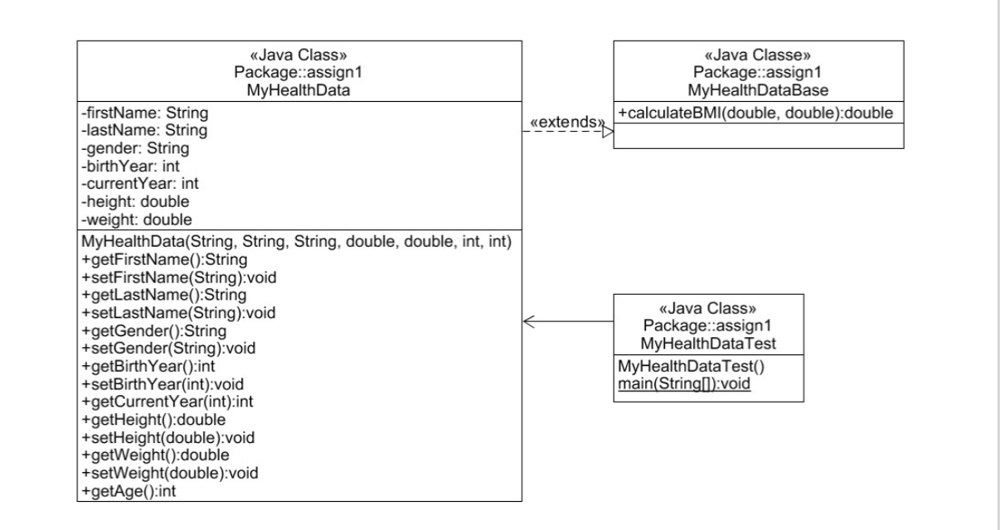

# Electronic-Health-Records-Java
<h3>How does it work?</h3>

  •	Designed a Health Record with Java to record patients’ information and calculate health metrics like BMI and heart rate 
  •	Managed each class to get the patient data with backend logic and utilized Java's exception handling to ensure robustness against wrong inputs. 
  •	Wrote the test plan and implemented Java Unit (JUnit) Testing including debugging tools to test methods for software testing. Produced JavaDoc by providing meaningful comments for each method 

<h3 align="left">UML</h3>

  

